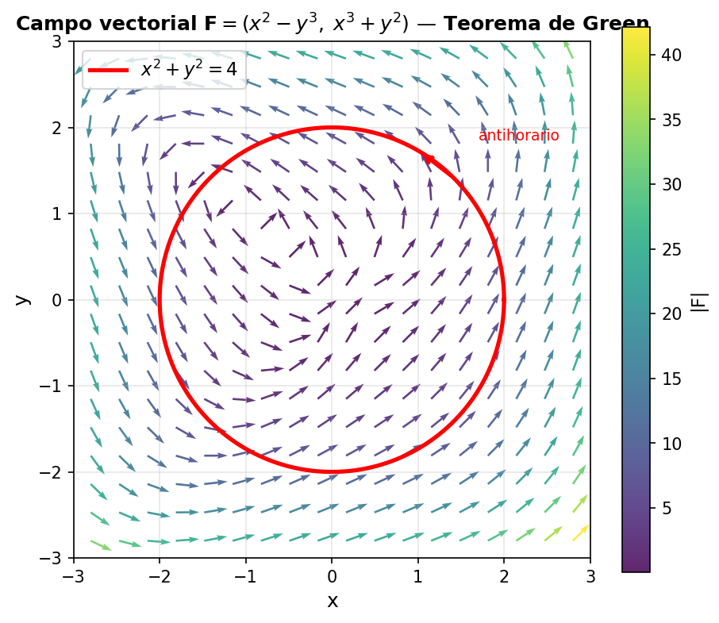
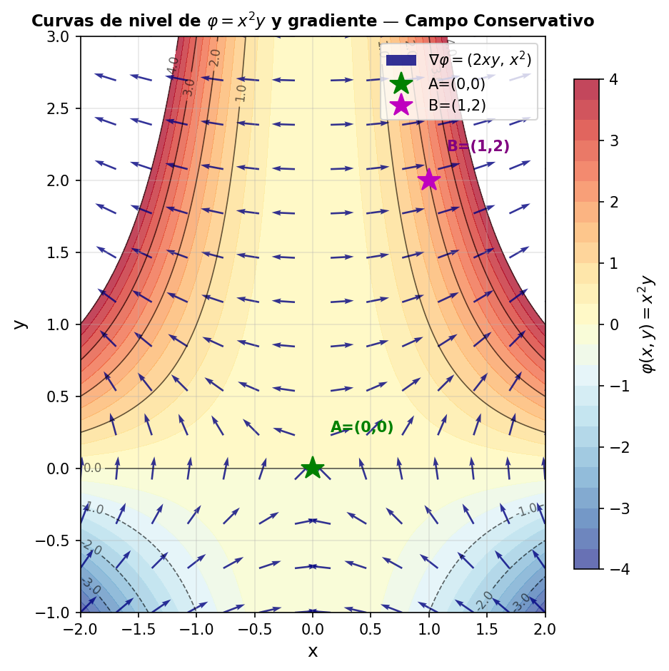
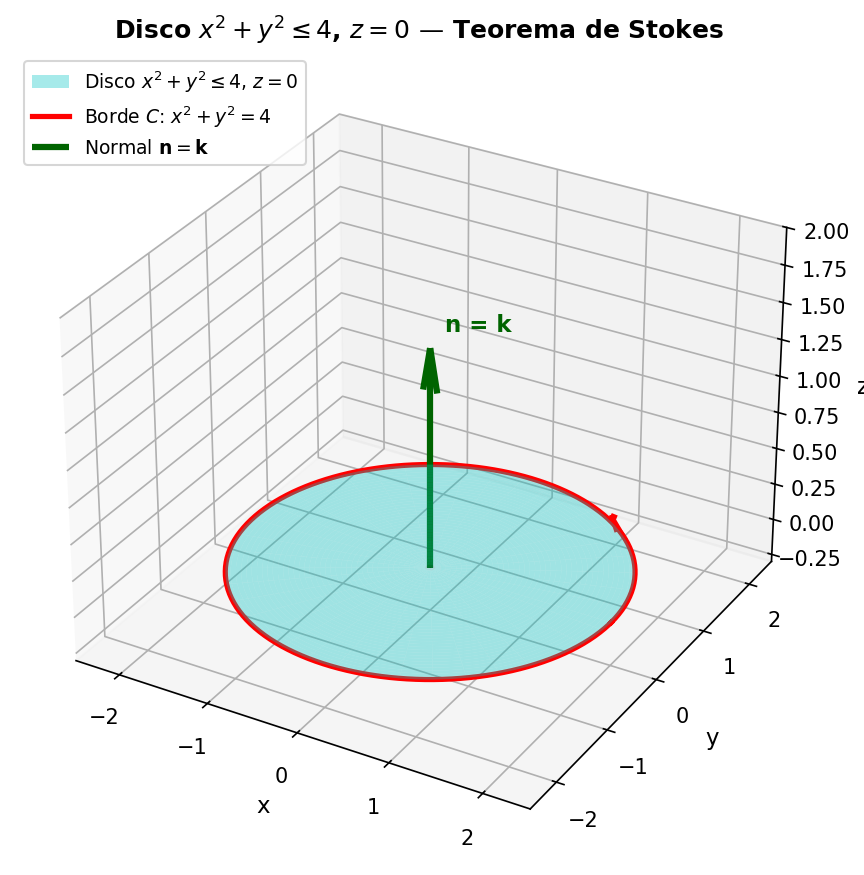

# Campos Vectoriales CIAF — Parcial Final Cálculo Multivariado

**Integrante:** Miguel Angel Ballesteros  
**Grupo:** 7mo Semestre — Ingeniería de Software  
**Institución:** CIAF 2026-1  

---

## Descripción

Proyecto de cálculo multivariado que implementa y verifica numéricamente tres teoremas del cálculo vectorial:

| # | Teorema | Ejercicio |
|---|---------|-----------|
| 1 | **Green** | Integral de línea de `(x²-y³)dx + (x³+y²)dy` sobre el círculo `x²+y²=4` |
| 2 | **Campo conservativo** | Verificación de `F=(2xy+z², x², 2xz)` y trabajo `W=φ(B)-φ(A)` |
| 3 | **Stokes** | Integral de `F=(z,x,y)` sobre el círculo `x²+y²=4`, `z=0` |

---

## Estructura del repositorio

```
campos-vectoriales-ciaf/
├── README.md
├── requirements.txt
├── src/
│   ├── vector_engine.py     # Cálculos numéricos y analíticos
│   └── visualizacion.py     # Generación de las 3 figuras PNG
├── tests/
│   └── test_engine.py       # 7 pruebas unitarias con pytest
├── output/
│   ├── fig_green.png
│   ├── fig_potencial.png
│   └── fig_stokes.png
└── docs/
    └── informe.pdf
```

---

## Instalación

```bash
# Clonar el repositorio
git clone https://github.com/[usuario]/campos-vectoriales-ciaf.git
cd campos-vectoriales-ciaf

# Instalar dependencias
pip install -r requirements.txt
```

---

## Uso

### Ejecutar los cálculos
```bash
python src/vector_engine.py
```

### Generar las figuras
```bash
python src/visualizacion.py
# Las imágenes se guardan en output/
```

### Correr las pruebas
```bash
pytest tests/ -v
```

---

## Tabla de resultados analíticos vs numéricos

| Ejercicio | Valor analítico | Valor numérico | Error relativo |
|-----------|----------------|---------------|----------------|
| Green (R=2) | `24π ≈ 75.3982` | `75.3982` | `< 0.001%` |
| Campo conservativo | `3.0000 J` | `3.0000 J` | `0.0000%` |
| Stokes (R=2) | `4π ≈ 12.5664` | `12.5621` | `< 0.04%` |

---

## Figuras generadas

### Figura 1 — Campo vectorial + curva (Green)


### Figura 2 — Curvas de nivel + gradiente (Conservativo)


### Figura 3 — Superficie 3D + borde (Stokes)

